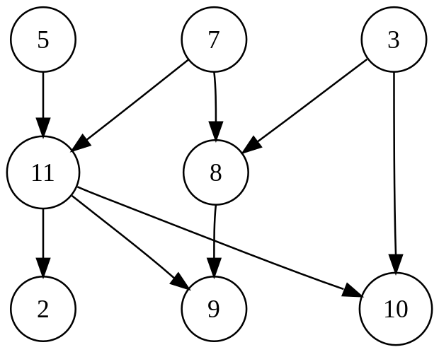

# Graph

---

A graph is made up of vertices (also called nodes or points) which are connected by edges (also called links or lines).
A distinction is made between undirected graphs, where edges link two vertices symmetrically, and directed graphs, where
edges link two vertices asymmetrically.

## Directed Graph

A directed graph with three vertices and four directed edges (the double arrow represents an edge in each direction).
A directed graph or digraph is a graph in which edges have orientations.

## Undirected Graph

A directed graph with three vertices and four directed edges (the double arrow represents an edge in each direction).
A directed graph or digraph is a graph in which edges have orientations.

## Graph Applications

| Applications | Purpose                |
|:-------------|:-----------------------|
| Social Media | Find Group of Networks |
| MAP          | Find Shortest Paths    |
| Biology      |                        |

## Detect Cycle in Graph

A path that starts from a given vertex and ends at the same vertex is called a cycle.

### Cycle in Undirected Graph

- How to detect cycle in undirected graph?

**The undirected graph has the cycle if:**

- The neighbor of the current vertex is already visited, and
- The neighbor is not the parent of the current vertex

### Cycle in Directed Graph

- How to detect cycle in directed graph?

**The directed graph has the cycle if:**

- The neighbor of the current vertex is already visited, and
- The neighbor exists in the path of the current vertex

## Topological Sort

A topological sort or topological ordering of a directed graph is a linear ordering of its vertices such that for every
directed edge (u,v) from vertex u to vertex v, u comes before v in the ordering.



- Applications of Topological Sort
    - Shorted Path
    - Scheduling a sequence of jobs or tasks based on their dependencies
    - Build Systems
    -


## Degree

The number of adjacent vertices of a vertex is called its degree.

- ```Out-Degree``` - All the vertices going out are called out-degree vertices.
- ```In-Degree``` - All the vertices coming in are called in-degree vertices.

- How to count number of vertices of a graph?
- How to count number of edges of a graph?
- 


## Euler Graph

- An ```Euler path``` is a path that uses every edge of a graph exactly once.
- An ```Euler circuit``` is a circuit that uses every edge of a graph exactly once.

- An ```Euler path``` starts and ends at different vertices. 
- An ```Euler circuit``` starts and ends at the same vertex.


### Bridge Edge

An edge is the bridge edge, if any one of the following 2 conditions satisfies for an ```E(u,v)```:

- If ```v``` is the only adjacent vertex of ```u```, or
- If there are multiple adjacent vertices of ```u```, then ```E(u,v)``` is not a bridge edge.

## References

- [Graph Theory](https://en.wikipedia.org/wiki/Graph_theory)
- [Glossary of Graph Theory](https://en.wikipedia.org/wiki/Glossary_of_graph_theory)
- [List of Graphs](https://en.wikipedia.org/wiki/List_of_graphs)
- [Cycle in Graph](https://en.wikipedia.org/wiki/Cycle_(graph_theory))
- [Topological Sort](https://en.wikipedia.org/wiki/Topological_sorting)
- [Euler Graph](https://jlmartin.ku.edu/courses/math105-F11/Lectures/chapter5-part2.pdf)

## Author(s)

---

- Rohtash Lakra
